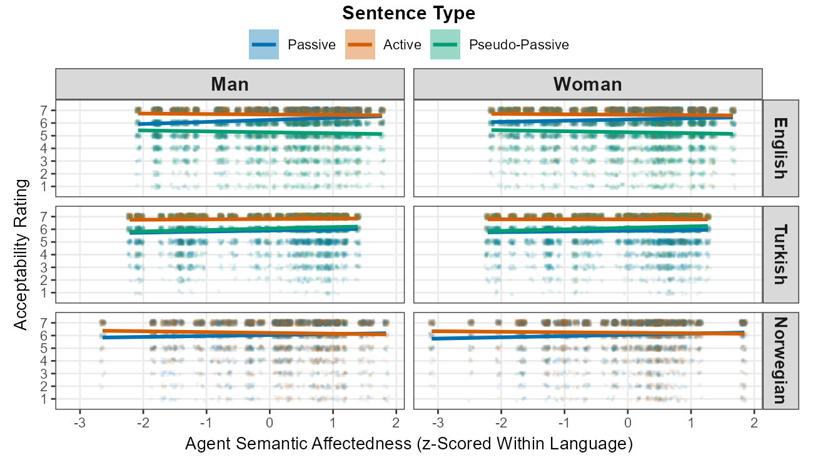

```{r}
#| label: setup
#| include: false
library(dplyr)
library(ggplot2)
library(knitr)
library(kableExtra)
library(readr)
library(tidyr)
library(purrr)

# Output tree. On the cluster the heavy outputs live under $DATA, not the repo,
# so the render job sets CLAPS_OUTPUTS_ROOT to that absolute path. Locally it
# defaults to the in-repo ../outputs tree.
OUT_ROOT    <- Sys.getenv("CLAPS_OUTPUTS_ROOT", "../outputs")
PILOT_DIR   <- file.path(OUT_ROOT, "pilot_models")
SENS_DIR    <- file.path(OUT_ROOT, "prior_sensitivity")
SUM_DIR     <- file.path(OUT_ROOT, "design_summary")
AUDIT_CSV   <- file.path(OUT_ROOT, "reference_audit", "reference_audit.csv")

BF_THRESHOLD_PRIMARY   <- 10
BF_THRESHOLD_SECONDARY <- 3

# Source headline quantities from the aggregated results rather than hard-coding them.
rec_n_single <- 80L; n_sims_single <- 200L; n_sims_cross <- 50L
.rec_csv <- file.path(SUM_DIR, "recommended_sample_size.csv")
.exc_csv <- file.path(SUM_DIR, "bf_exceedance.csv")
if (file.exists(.rec_csv)) {
  .r <- readr::read_csv(.rec_csv, show_col_types = FALSE)
  rec_n_single <- max(.r$recommended_n_participants[.r$language != "AllLanguages"], na.rm = TRUE)
}
if (file.exists(.exc_csv)) {
  .e <- readr::read_csv(.exc_csv, show_col_types = FALSE)
  n_sims_single <- min(.e$n_sims[.e$language != "AllLanguages"], na.rm = TRUE)
  n_sims_cross  <- min(.e$n_sims[.e$language == "AllLanguages"], na.rm = TRUE)
}
mc_se <- sqrt(0.8 * 0.2 / n_sims_single)
```

```{r}
#| label: check-audit
#| include: false
if (file.exists(AUDIT_CSV)) {
  audit <- read_csv(AUDIT_CSV, show_col_types = FALSE)
  n_bad <- sum(audit$flag %in% c("ERROR", "TITLE_MISMATCH", "YEAR_MISMATCH"), na.rm = TRUE)
  if (n_bad > 0) stop("Reference audit failed with ", n_bad, " errors. Fix references.bib first.")
}
```

# Part I: Rationale

This part sets out the rationale for the CLAPS design analysis. It motivates the
affectedness account behind the focal hypotheses, explains why the acceptability
ratings are modelled with a Bayesian cumulative-ordinal mixed-effects model, gives
the prior specifications that make the Bayes factors well defined and describes the
simulation framework behind the power analysis.

## Background and Theoretical Motivation

The CLAPS question is whether acceptability of passive and related sentence types
tracks semantic affectedness, and whether this slope differs by sentence type.
*Affectedness* — the degree to which a patient or theme participant undergoes a
change of state or is causally impinged upon by the action — is a core dimension of
argument structure [@dowty1991; @beavers2011], and it has long been argued to be the
semantic core of the passive, which is associated with the meaning that the surface
subject "is in a state or circumstance characterized by [the by-object] having acted
upon it" [@pinkerLebeauxFrost1987]. Across languages, the prediction that passive
acceptability is semantically structured rather than purely syntax-driven is
supported by adult grammaticality-judgment and comprehension studies
[@ambridgeBidgoodPineRowlandFreudenthal2016; @aryawibawaAmbridge2018;
@darmasetiyawanAmbridge2022; @liuAmbridge2021;
@bidgoodPineRowlandAmbridge2020; @ambridgeArnonBekman2023].

Developmental and processing evidence converges on the same constraint: not all
verb classes support passive comprehension or production equally — children acquire
actional, highly affected-patient passives earlier and more reliably than
non-actional ones — and affectedness-like semantic factors remain explanatory even
when syntactic form is controlled [@maratsosFoxBeckerChalkley1985;
@pinkerLebeauxFrost1987; @nguyenPearl2021; @agostinhoGavarroSantos2025;
@paolazziGrilloCeraKarageorgouBullmanChowSanti2022;
@darmasetiyawanMessengerAmbridge2022].

To date this cross-linguistic evidence base spans English, Indonesian, Balinese,
Hebrew and Mandarin; the affectedness constraint on passive acceptability has not
previously been tested in Turkish or Norwegian. CLAPS therefore extends the paradigm
to two typologically and morphologically distinct languages for which no
language-specific effect-size estimates yet exist — one reason the focal-slope priors
are not anchored to language-specific values (see below).

This motivates a design analysis that quantifies whether realistic sample sizes,
given ARC compute constraints, can recover the focal directional effects as Bayes
factors under plausible data-generating values.

## The Bayesian Cumulative-Ordinal Mixed-Effects Model

The CLAPS outcome is a discrete 1–7 Likert rating of sentence acceptability.
Treating Likert responses as continuous and modelling them with a Gaussian
likelihood biases regression coefficients and inflates both Type I and Type II
error in the presence of floor or ceiling effects [@liddellKruschke2018]. The
cumulative-logit model is the principled alternative because it respects the
discreteness, ordering and bounded nature of Likert data while leaving the
latent scale free to vary continuously across conditions [@burknerVuorre2019].
Recent empirical psycholinguistic work has independently confirmed substantial
inferential gains when Likert acceptability ratings are modelled cumulatively
rather than metrically [@verissimo2021; @taylorRousseletScheepersSereno2023].

A Bayesian multilevel framework is required because Bayes factors depend on
proper priors and full model likelihoods, uncertainty in hierarchical variance
and correlation terms must be propagated, and the design analysis must evaluate
directional evidence thresholds directly. The implementation uses `brms` /
`cmdstanr` [@burkner2017; @burkner2018], with directional Savage–Dickey Bayes
factors as the primary inferential quantity
[@wagenmakersLodewyckxKuriyalGrasman2010;
@schadNicenboimBurknerBetancourtVasishth2023].

## Empirical Basis for the Focal-Slope Prior Scales

The focal predictor is `Semantics_scaled`: a standardised measure of the semantic
affectedness of the patient. The directional CLAPS hypothesis is that affectedness
raises acceptability in the canonical passive and that this slope is attenuated,
abolished or reversed in the active and in the pseudo-passive comparison sentence
types. The central finding of the cross-language synthesis is exactly this pattern:
affectedness predicts acceptability for both passives and actives but the effect is
reliably *larger* for passives, and it is absent for pseudo-passives
[@ambridgeArnonBekman2023].

The previously observed magnitude of the affectedness slope in canonical passives,
taken from independent samples of English, Indonesian, Balinese, Hebrew and Mandarin
speakers, is of the order of 0.3 to 0.8 in the units reported by those studies
[@ambridgeBidgoodPineRowlandFreudenthal2016; @aryawibawaAmbridge2018;
@darmasetiyawanAmbridge2022; @liuAmbridge2021], with a cross-language pooled posterior
mean of approximately 0.47 from the Bayesian meta-analytic synthesis
[@ambridgeArnonBekman2023]. The S_Type × Semantics interaction (active minus passive)
is correspondingly negative, of the order of −0.2 to −0.4. Because those antecedent
studies modelled rating responses on their original (5- or 7-point) scales rather
than on a cumulative-logit latent scale, these magnitudes are used as
order-of-magnitude anchors for the log-odds-scale priors below, not as exact
transcriptions; the prior scales are deliberately wide enough to absorb the resulting
scale uncertainty.

The `primary` prior set therefore uses zero-centred Gaussians concentrated
enough to cover the previously observed range without pre-loading the directional
Bayes factor test. The Semantics slope receives `normal(0, 0.5)`, which places
approximately 95% of prior mass between −1 and +1. The active–passive interaction
receives the same scale. The pseudo-passive interaction receives a slightly wider
`normal(0, 0.6)`: although the synthesis implies a negative pseudo-minus-passive
interaction (affectedness does not raise pseudo-passive acceptability), pseudo-passive
constructions are attested in only a subset of the contributing languages, so this
interaction is less precisely constrained cross-linguistically than the
active–passive one [@ambridgeArnonBekman2023]. The direction-encoding
`literature_centred` sensitivity regime makes these anchors explicit, centring the
three focal slopes on approximately 0.47, −0.31 and −0.36 respectively (see
Appendix A); it is reported as a sensitivity-only check because it encodes the
predicted direction.

## Proper Priors for Bayes Factors

Marginal likelihoods, and therefore Bayes factors, are scale-sensitive functionals
of the prior. Improper or extremely diffuse priors yield either undefined or
arbitrarily small marginal likelihoods regardless of the data
[@gelmanSimpsonBetancourt2017; @schadNicenboimBurknerBetancourtVasishth2023;
@gronauSarafoglouEtAl2017]. All four prior regimes in `R/03_define_priors.R` are
therefore proper. The Savage–Dickey ratio is computed under the primary regime;
bridge sampling under all four regimes provides calibration
[@gronauSarafoglouEtAl2017; @gronauSingmannWagenmakers2020].

The four-regime sensitivity grid follows @schadNicenboimBurknerBetancourtVasishth2023:
the `primary` regime is zero-centred and weakly-to-moderately informative; `weak`
relaxes all focal-slope scales; `literature_centred` is sensitivity-only and
direction-encoding; `heavy_tailed` substitutes Student-t for Gaussian focal-slope
priors.

## Variance-Component and Correlation Priors

Hierarchical variance priors must be chosen carefully because Inverse-Gamma and
other classical defaults concentrate prior mass away from zero and bias variance
estimates upwards in small samples [@gelman2006]. @chungGelmanRabeHeskethLiuDorie2015
and @simpsonRueRieblerMartinsSorbye2017 recommend half-Normal or half-Student-t
priors on the standard-deviation scale. The CLAPS workflow therefore uses
`student_t(3, 0, 1)` on all `sd` parameters across regimes.

Group-level correlation matrices use the LKJ prior
[@lewandowskiKurowickaJoe2009] with shape $\eta$ = 2 in the primary,
literature-centred and heavy-tailed regimes, which mildly concentrates prior mass
toward the identity matrix and so regularises the many correlation parameters of the
maximal random-effects structure; the `weak` regime uses $\eta$ = 1, which is uniform over
correlation matrices, as a sensitivity comparison.

## Random-Effects Structure

The maximal random-effects ladder is motivated by @barrLevyScheepersTily2013.
Where models with fully crossed by-Participant and by-Verb random slopes fail to
converge after the prespecified diagnostic budget, the workflow steps down one rung
at a time following @matuschekKlieglVasishthBaayenBates2017. Treatment coding of
`S_Type` with `Passive` as the reference level preserves direct interpretability
of the focal coefficients [@brehmAlday2022]. Sample-size adequacy and the risk of
optimistic generalisation from a single pilot are addressed using the framework of
@westfallYarkoni2016 and @albersLakens2018.

## Bayes-Factor Thresholds

CLAPS reports the conventional descriptive grades for Bayes factors ("anecdotal",
"moderate", "strong", "very strong", "extreme"), which originate with @jeffreys1961
and follow the modern relabelling of @leeWagenmakers2013. These labels are
descriptive only: directional Savage–Dickey ratios
[@wagenmakersLodewyckxKuriyalGrasman2010] on each focal coefficient are reported with
full posterior quantification. Calibration via bridge sampling
[@gronauSarafoglouEtAl2017; @gronauSingmannWagenmakers2020] is reported alongside
the primary ratios.

## Convergence Diagnostics and Prior-Predictive Checks

Every confirmatory fit must clear a fixed battery of diagnostics before it is
counted: a rank-normalised, folded $\hat{R}$ below 1.01 on all parameters
[@vehtariGelmanSimpsonCarpenterBurkner2021], bulk and tail ESS of at least 400 on all
focal coefficients, zero post-warmup divergent transitions with no maximum-treedepth
saturations [@gabrySimpsonVehtariBetancourtGelman2019; @nicenboimSchadVasishth2025]
and a passed prior-predictive check confirming that the prior over Likert response
distributions is plausibly varied without being degenerate
[@gabrySimpsonVehtariBetancourtGelman2019; @schadBetancourtVasishth2021]. Fits that
fail any of these are stepped down the random-effects ladder rather than reported.

## Pilot–Confirmatory Data Separation

Pilot data inform `compute_ceiling_calibrated_thresholds()` and
`literature_centred` priors, but `split_pilot_confirmatory()` in
`R/01_read_validate_data.R` ensures they are never passed to the confirmatory
model. This separation is required for the validity of the sensitivity-only
`literature_centred` regime, which would otherwise double-count pilot information
[@albersLakens2018; @schadNicenboimBurknerBetancourtVasishth2023].

## Simulation Design and Power Criteria

This is a Bayes-factor design analysis (BFDA): for each design cell it estimates, by
simulation, the sampling distribution of the focal Bayes factors and hence the
probability of obtaining compelling evidence at a given sample size
[@schonbrodtWagenmakers2018; @stefanGronauSchonbrodtWagenmakers2019]. Because the
focal priors are anchored to previously observed effect magnitudes, the
informed-prior BFDA variant of @stefanGronauSchonbrodtWagenmakers2019 is the
appropriate template. Reporting the full operating characteristics, rather than a
single power figure, also guards against the sign (Type S) and magnitude (Type M)
errors that threaten inferences from small or noisy designs [@gelmanCarlin2014].

Each design *condition* combines language and design settings, model level, prior
regime and sample size. To estimate a genuine power (exceedance) probability
rather than a single-draw indicator, every condition is replicated across
`n_simulations_per_cell` independently seeded simulated data sets — 200 for the
single-language and gender conditions and 50 for the (8–12 h/fit) cross-language
conditions — built by `scripts/generate_design_grid.R`, with one SLURM array task
per replicate. Replicate fits use a lighter sampler (4 chains × 3000 iterations,
`adapt_delta = 0.99`) sufficient for a single reliable Bayes factor; the heavy
16-chain × 5000-iteration sampler is reserved for the one-off maximal-model
convergence demonstration that establishes the maximal feasible model and runtimes.
SLURM arrays run replicates in parallel on ARC CPUs. For each condition, the analysis
summarises the probability that Bayes factors exceed the primary and secondary
thresholds, the sensitivity of the BF category to prior regime, the feasibility
diagnostics and ladder-selection frequency and the convergence and sampler
diagnostics. The descriptive evidence grades follow @jeffreys1961 and
@leeWagenmakers2013, while interpretation remains tied to continuous BF values and
robustness checks [@schadNicenboimBurknerBetancourtVasishth2023].

# Part II: Pilot Results (Calibration Only)

This part reports the pilot-data analyses, which serve calibration purposes only.
The pilot data are excluded from the final confirmatory analysis; the findings here
inform prior choice and model-ladder decisions but do not constitute confirmatory
evidence.

## Pilot Data Overview

The pilot sample provides acceptability ratings for the three CLAPS languages,
English, Norwegian and Turkish, across the passive, active and (where the
construction is attested) pseudo-passive sentence types, with the agent-affectedness
predictor measured for each item. These data are used only to calibrate the
threshold priors and to choose the random-effects structure carried into the design
analysis; they enter no confirmatory model.

## Referent Gender

A further model variation adds referent gender as a covariate, to control for any
unbalanced real-world association between particular actions and gender.
@fig-gender shows the raw pilot acceptability data on the key comparison of sentence
type against affectedness, split by gender and language. The sentence-type orderings
and the affectedness slopes are closely matched for men and women within each
language, so the focal effects are not being driven by a gender imbalance. This is
consistent with the modelling result that adding the covariate barely shifts the
power curve, so the gender model serves as a robustness check rather than a source of
divergent conclusions.

```{r}
#| label: fig-gender
#| fig-cap: "Raw Pilot Acceptability by Agent Semantic Affectedness, Sentence Type, Referent Gender and Language"
#| fig-width: 6.5
#| fig-height: 3.8
#| dev: png
#| fig-dpi: 300
pilot_csv <- "../data/pilot/claps_pilot_harmonised.csv"
if (file.exists(pilot_csv)) {
  pal_g <- c("Passive" = "#0072B2", "Active" = "#D55E00", "Pseudo-Passive" = "#009E73")
  dg <- readr::read_csv(pilot_csv, show_col_types = FALSE) |>
    dplyr::mutate(Gender = sub(".*_", "", Item)) |>
    dplyr::filter(S_Type %in% c("Passive", "Active", "Pseudo_Passive"),
                  Gender %in% c("Man", "Woman")) |>
    dplyr::group_by(Language) |>
    dplyr::mutate(affect_z = as.numeric(scale(affectedness_scores_agent))) |>
    dplyr::ungroup() |>
    dplyr::mutate(
      S_Type   = factor(S_Type, levels = c("Passive", "Active", "Pseudo_Passive"),
                        labels = c("Passive", "Active", "Pseudo-Passive")),
      Gender   = factor(Gender, levels = c("Man", "Woman")),
      Language = factor(Language, levels = c("English", "Turkish", "Norwegian")))
  ggplot2::ggplot(dg, ggplot2::aes(affect_z, Response, colour = S_Type, fill = S_Type)) +
    ggplot2::geom_jitter(width = 0.04, height = 0.20, alpha = 0.05, size = 0.45,
                         show.legend = FALSE) +
    ggplot2::geom_smooth(method = "lm", formula = y ~ x, se = TRUE, linewidth = 1) +
    ggplot2::facet_grid(Language ~ Gender) +
    ggplot2::scale_colour_manual(values = pal_g) +
    ggplot2::scale_fill_manual(values = pal_g) +
    ggplot2::scale_y_continuous(breaks = 1:7, limits = c(0.5, 7.5)) +
    ggplot2::labs(x = "Agent Semantic Affectedness (z-Scored Within Language)",
                  y = "Acceptability Rating",
                  colour = "Sentence Type", fill = "Sentence Type") +
    ggplot2::guides(colour = ggplot2::guide_legend(title.position = "top"),
                    fill   = ggplot2::guide_legend(title.position = "top")) +
    ggplot2::theme_bw(base_size = 10) +
    ggplot2::theme(
      legend.position    = "top",
      legend.direction   = "horizontal",
      panel.grid.minor   = ggplot2::element_blank(),
      legend.title       = ggplot2::element_text(hjust = 0.5, face = "bold", size = 11),
      strip.text.x       = ggplot2::element_text(face = "bold", size = 11),
      strip.text.y       = ggplot2::element_text(face = "bold", size = 10,
                            margin = ggplot2::margin(t = 12, r = 6, b = 12, l = 6, unit = "pt")),
      legend.margin      = ggplot2::margin(0, 0, 2, 0, unit = "pt"),
      legend.box.spacing = ggplot2::unit(3, "pt"),
      axis.title.x       = ggplot2::element_text(margin = ggplot2::margin(t = 4, b = 8, unit = "pt")),
      axis.title.y       = ggplot2::element_text(margin = ggplot2::margin(r = 6, unit = "pt")),
      plot.margin        = ggplot2::margin(t = 2, r = 8, b = 5, l = 8, unit = "pt"))
} else {
  
}
```

```{=latex}
\vspace{-1.9em}
```

*Note.* Points are individual ratings (jittered). Lines show per-sentence-type linear trends. The Norwegian pilot has no pseudo-passive. Pilot data are used for calibration only.

## Model Ladder Results

The model ladder was traversed from L5 (correlated maximal) downward, with the
selected level for each language being the highest that compiled, converged and
showed no material posterior pathologies. In the pilot fits the full
correlated-maximal structure (L5) was estimable for each single language, so that
level was carried into the design analysis. The pooled cross-language model required
one step down to an uncorrelated maximal structure (L4), as the design-analysis
feasibility results in Part III confirm.

## Convergence Diagnostics

Convergence was assessed using $\hat{R}$ [@vehtariGelmanSimpsonCarpenterBurkner2021],
bulk and tail ESS, the number of divergent transitions and maximum tree-depth
exceedances. Every fit retained for calibration met the publication-grade thresholds
set out in Part I; fits that did not were stepped down the ladder rather than
retained.

## Prior Sensitivity Results

The sensitivity analysis evaluates how Bayes-factor estimates and posterior summaries
change across the four prior regimes (primary, weak, literature-centred and
heavy-tailed) and the two threshold modes (broad and ceiling-calibrated). The
quantitative four-regime comparison, computed on the design-analysis simulations, is
reported in Part III under Prior Sensitivity of BF Category. At the pilot stage the
comparison served only to confirm that prior choice does not change the qualitative
conclusions.

## Threshold Prior Calibration

For Turkish, the pilot data showed strong upper-end clustering. Ceiling-calibrated
threshold priors were derived using smoothed cumulative category proportions and
`qlogis()` [@gelman2006; @gelmanSimpsonBetancourt2017; @burknerVuorre2019]. Prior
predictive simulations confirmed that ceiling-calibrated priors produce
distributions more consistent with the Turkish pilot response profile.

## Conclusions for Prior Determination

The pilot analysis fixes the inputs to the design analysis. The `primary` prior is
retained as prespecified, with `ceiling_calibrated` thresholds for Turkish, where the
pilot ratings clustered at the upper end. The maximal feasible model is the
correlated-maximal structure (L5) for each single language and the uncorrelated
cross-language structure (L4) for the pooled model. Prior choice does not alter the
focal conclusions, as the four-regime comparison in Part III confirms.

# Part III: Design Analysis Results

This part reports the design analysis itself: the simulation framework and focal
hypotheses, the feasibility of the planned models, the Bayes-factor power curves
across sample size, their sensitivity to the prior and the resulting per-language
sample-size recommendation.

## Design Analysis Framework

The Bayes-factor design analysis estimates, via simulation, the probability that
the prespecified Bayes-factor thresholds are exceeded for each focal hypothesis
under a range of sample sizes, prior regimes and model-ladder levels
[@schonbrodtWagenmakers2018; @stefanGronauSchonbrodtWagenmakers2019].

The focal hypotheses are directional. H1a states that the affectedness slope is
positive for passives, $\beta_{\text{Semantics}} > 0$. H1b states that this slope is
smaller for actives than for passives,
$\beta_{\text{S\_TypeActive:Semantics}} < 0$, and it carries the main theoretical
weight. In languages with a pseudo-passive, a secondary hypothesis (H2) concerns
$\beta_{\text{S\_TypePseudo\_Passive:Semantics}}$, whose direction is reported both
ways.

The primary success metric is $BF_{10} > `r BF_THRESHOLD_PRIMARY`$ (strong evidence,
after @jeffreys1961) and the secondary metric is
$BF_{10} > `r BF_THRESHOLD_SECONDARY`$ (moderate evidence). Bayes factors are
computed via the Savage–Dickey directional density ratio from `brms` models with
`sample_prior = "yes"` [@wagenmakersLodewyckxKuriyalGrasman2010;
@schadNicenboimBurknerBetancourtVasishth2023], with bridge sampling as a calibration
check only [@gronauSarafoglouEtAl2017; @gronauSingmannWagenmakers2020].

## Failure and Feasibility Summary

Every design cell that was launched produced a usable fit. The summary below records
the successes against the possible failure modes (estimation error, timeout,
out-of-memory and malformed output).

```{r}
#| label: failure-summary
fail_path <- file.path(SUM_DIR, "failure_summary.csv")
if (file.exists(fail_path)) {
  fail_df <- readr::read_csv(fail_path, show_col_types = FALSE)
  knitr::kable(fail_df, caption = "Failure and Feasibility Summary Across All Design Cells",
               booktabs = TRUE)
} else {
  cat("Failure summary not yet available (run scripts/06_aggregate_design_results.R).\n")
}
```

## BF Exceedance Probabilities by Sample Size

The probability of exceeding the Bayes-factor thresholds rises with sample size for
every focal hypothesis. The figure shows the power curves for the two focal
hypotheses under the primary prior. The full operating characteristics across all
conditions, prior regimes and hypotheses are tabulated in Appendix D.

```{r}
#| label: bf-exceedance-plot
#| fig-cap: "Bayesian Power Curves for the Two Focal Hypotheses, by Language"
#| fig-width: 6.5
#| fig-height: 2.9
exc_path <- file.path(SUM_DIR, "bf_exceedance.csv")
if (file.exists(exc_path)) {
  exc_df <- readr::read_csv(exc_path, show_col_types = FALSE)
  plot_df <- exc_df |>
    dplyr::filter(prior_regime == "primary", n_verbs == 20,
                  hypothesis %in% c("H1a_semantics_positive",
                                    "H1b_active_interaction_negative"),
                  model_level %in% c("L5_correlated_maximal",
                                     "L4_cross_uncorrelated")) |>
    dplyr::mutate(
      Hypothesis = ifelse(hypothesis == "H1a_semantics_positive", "H1a", "H1b"),
      language   = factor(language,
                          levels = c("English", "Norwegian", "Turkish", "AllLanguages"),
                          labels = c("English", "Norwegian", "Turkish", "All (Pooled)"))
    )
  pc_labels <- plot_df |>
    dplyr::filter(n_participants == 50) |>
    dplyr::mutate(y_lab = ifelse(Hypothesis == "H1a", 0.94, p_bf_primary + 0.08))
  ggplot2::ggplot(plot_df,
                  ggplot2::aes(n_participants, p_bf_primary, colour = Hypothesis)) +
    ggplot2::geom_hline(yintercept = 0.80, linetype = "dashed",
                        colour = "grey50", linewidth = 0.45) +
    ggplot2::geom_line(linewidth = 0.7) +
    ggplot2::geom_point(size = 1.8) +
    ggplot2::geom_label(data = pc_labels,
                        ggplot2::aes(x = 52, y = y_lab, label = Hypothesis),
                        hjust = 0, vjust = 0.5, size = 2.6, fontface = "bold",
                        fill = "white", label.size = 0,
                        label.padding = ggplot2::unit(0.08, "lines"),
                        show.legend = FALSE) +
    ggplot2::facet_wrap(~ language, nrow = 1) +
    ggplot2::scale_x_continuous(breaks = seq(30, 100, 20)) +
    ggplot2::scale_y_continuous(
      labels = function(x) paste0(round(x * 100), "%"),
      limits = c(0, 1), breaks = seq(0, 1, 0.2)) +
    ggplot2::scale_colour_manual(values = c(H1a = "#0072B2", H1b = "#D55E00")) +
    ggplot2::labs(
      x = expression(paste("Participants per Language (", italic(N), ")")),
      y = expression(italic(P)(BF[10] > 10))) +
    ggplot2::guides(colour = "none") +
    ggplot2::theme_minimal(base_size = 10) +
    ggplot2::theme(
      panel.border     = ggplot2::element_rect(colour = "grey65", fill = NA,
                                               linewidth = 0.4),
      panel.grid.minor = ggplot2::element_blank(),
      panel.spacing    = ggplot2::unit(10, "pt"),
      strip.background = ggplot2::element_rect(fill = "grey90", colour = NA),
      strip.text       = ggplot2::element_text(face = "bold", size = 10),
      axis.title.x     = ggplot2::element_text(margin = ggplot2::margin(t = 8)),
      axis.title.y     = ggplot2::element_text(margin = ggplot2::margin(r = 6)),
      plot.margin      = ggplot2::margin(t = 5, r = 10, b = 5, l = 5)
    )
}
```

```{=latex}
\vspace{-1.9em}
```

*Note.* Points are exceedance probabilities, *P*(*BF*~10~ > 10), under the primary prior. The dashed line marks the conventional 80% target. The pooled cross-language analysis was simulated to *N* = 60.

## Prior Sensitivity of BF Category

Prior choice shifts the Bayes-factor power only modestly. The table reports the
power for each focal hypothesis under all four prior regimes at the anchor sample
size, where every regime was simulated. The semantic effect (H1a) is at ceiling
throughout, while the interaction (H1b) moves within a narrow band.

```{r}
#| label: prior-sensitivity
sens_path <- file.path(SUM_DIR, "bf_exceedance.csv")
if (file.exists(sens_path)) {
  sens_focal <- c(H1a = "H1a_semantics_positive",
                  H1b = "H1b_active_interaction_negative")
  sens_exc <- readr::read_csv(sens_path, show_col_types = FALSE) |>
    dplyr::filter(hypothesis %in% sens_focal, n_verbs == 20,
                  model_level == "L5_correlated_maximal")
  # The non-primary regimes were simulated at a single anchor sample size, so
  # report the N at which the most prior regimes are available.
  anchor_n <- sens_exc |>
    dplyr::group_by(n_participants) |>
    dplyr::summarise(k = dplyr::n_distinct(prior_regime), .groups = "drop") |>
    dplyr::slice_max(k, n = 1, with_ties = FALSE) |>
    dplyr::pull(n_participants)
  sens_tbl <- sens_exc |>
    dplyr::filter(n_participants == anchor_n) |>
    dplyr::mutate(Hypothesis = names(sens_focal)[match(hypothesis, sens_focal)],
                  power = round(100 * p_bf_primary)) |>
    dplyr::select(Language = language, Hypothesis, prior_regime, power) |>
    tidyr::pivot_wider(names_from = prior_regime, values_from = power) |>
    dplyr::relocate(dplyr::any_of("primary"), .after = Hypothesis) |>
    dplyr::arrange(Language, Hypothesis)
  knitr::kable(
    sens_tbl,
    caption = sprintf(paste("Prior Sensitivity of Statistical Power, as a Percentage,",
                            "Across Prior Regimes at N = %d (Maximal Model, 20 Verbs)"), anchor_n),
    booktabs = TRUE
  ) |>
    kableExtra::kable_styling(font_size = 9)
} else {
  cat("Prior sensitivity results not yet available.\n")
}
```

## Model Ladder Selection Frequency

The ladder rarely needed to step down. The table records how often each level was
the highest feasible model across the simulated fits.

```{r}
#| label: ladder-selection
ladder_path <- file.path(SUM_DIR, "ladder_selection.csv")
if (file.exists(ladder_path)) {
  ladder_df <- readr::read_csv(ladder_path, show_col_types = FALSE)
  knitr::kable(
    ladder_df,
    caption = "Frequency With Which Each Model-Ladder Level Was the Highest Feasible Model",
    booktabs = TRUE
  )
} else {
  cat("Ladder selection results not yet available.\n")
}
```

## Maximal Feasible Model

The maximal feasible model is the highest-complexity ladder level that both fit and
met the publication-grade convergence criteria set out in Part I. The table gives it
for each language alongside the number of converged cells.

```{r}
#| label: maximal-feasible-model
mfm_path <- file.path(SUM_DIR, "maximal_feasible_model.csv")
if (file.exists(mfm_path)) {
  mfm_df <- readr::read_csv(mfm_path, show_col_types = FALSE)
  knitr::kable(
    mfm_df,
    caption = "Maximal Feasible (Converged) Model Level per Language",
    booktabs = TRUE
  )
} else {
  cat("Maximal feasible model not yet available (run scripts/06_aggregate_design_results.R).\n")
}
```

## Fit Runtimes

Fit cost varied widely by model and language, with the pooled cross-language fits
much heavier than the single-language ones. The table summarises per-cell runtimes
and convergence rates.

```{r}
#| label: runtime-summary
rt_path <- file.path(SUM_DIR, "runtime_summary.csv")
if (file.exists(rt_path)) {
  rt_df <- readr::read_csv(rt_path, show_col_types = FALSE)
  knitr::kable(
    rt_df,
    caption = "Per-Cell Fit Runtimes (Minutes) and Convergence Rate, by Language and Model Level",
    booktabs = TRUE, digits = 2
  ) |>
    kableExtra::kable_styling(font_size = 9)
} else {
  cat("Runtime summary not yet available.\n")
}
```

## Conclusions and Recommended Sample Size

The design analysis yields a per-language sample-size recommendation at the assumed
effect, together with the maximal model that can be estimated for each.

```{r}
#| label: conclusions
#| results: asis
mfm_path <- file.path(SUM_DIR, "maximal_feasible_model.csv")
rec_path <- file.path(SUM_DIR, "recommended_sample_size.csv")
rt_path  <- file.path(SUM_DIR, "runtime_summary.csv")
if (file.exists(rec_path) && file.exists(mfm_path)) {
  mfm_df <- readr::read_csv(mfm_path, show_col_types = FALSE)
  rec_df <- readr::read_csv(rec_path, show_col_types = FALSE)
  langs  <- c(setdiff(rec_df$language, "AllLanguages"),
              intersect(rec_df$language, "AllLanguages"))
  for (lg in langs) {
    r   <- dplyr::filter(rec_df, language == lg)
    m   <- dplyr::filter(mfm_df, language == lg)
    mod <- if (nrow(m) > 0) m$maximal_feasible_model[1] else "n/a"
    lab <- if (lg == "AllLanguages") "the pooled cross-language analysis" else lg
    if (isTRUE(r$meets_target[1]) && !is.na(r$recommended_n_participants[1])) {
      cat(sprintf(
        "For %s, the maximal feasible model is `%s`, and the recommended sample size is %.0f participants (%.0f verbs) to reach P(BF > %d) of at least %.0f%% on both focal hypotheses under the %s prior. ",
        lab, mod, r$recommended_n_participants[1], r$n_verbs[1],
        BF_THRESHOLD_PRIMARY, 100 * r$target[1], r$regime[1]))
    } else {
      cat(sprintf(
        "For %s, the maximal feasible model is `%s`, and no sample size in the grid reached P(BF > %d) of at least %.0f%% on both focal hypotheses, so the grid would need to extend to larger N or the data-generating assumptions revisited. ",
        lab, mod, BF_THRESHOLD_PRIMARY, 100 * r$target[1]))
    }
  }
  if (file.exists(rt_path)) {
    rt_df <- readr::read_csv(rt_path, show_col_types = FALSE)
    cat(sprintf(
      "\n\nAcross converged fits the median cell took %.1f minutes, with the heaviest reaching %.1f minutes.\n",
      stats::median(rt_df$median_runtime_min, na.rm = TRUE),
      max(rt_df$max_runtime_min, na.rm = TRUE)))
  }
} else {
  cat("Recommendations are not yet available; run the design grid and ",
      "`scripts/06_aggregate_design_results.R` to populate the maximal feasible model, ",
      "recommended sample size and runtimes.\n")
}
```

Each exceedance probability above is a Monte-Carlo estimate over
`n_simulations_per_cell` independently seeded replicates — `r n_sims_single` for single-language
and gender conditions (Monte-Carlo *SE* $\approx$ `r sprintf("%.3f", mc_se)` near a true rate of 0.8) and
`r n_sims_cross` for cross-language conditions — so the recommended sample sizes are stable
long-run rates rather than the indicative 0/1 values of the earlier single-seed
feasibility run (archived under `outputs/design_analysis_feasibility_v1`, which also
documents the L5 maximal-model convergence and per-fit runtimes). All
recommendations remain conditional on the data-generating parameters encoded in
`scripts/generate_design_grid.R`, whose sensitivity is examined via the prior
regimes in the full exceedance table.

One assumption requires particular care. These curves condition on assumed true
effect sizes anchored to the published affectedness estimates, and that anchor
warrants caution. The relevant literature is subject to publication bias and the
structural pressures of publish-or-perish culture, which together tend to inflate
reported effects. Studies reporting positive findings, especially small and
low-powered ones, systematically overstate the magnitude of what they detect, the
winner's curse or Type M error [@gelmanCarlin2014; @ioannidis2008; @button2013].
Design analyses built on the surviving published estimates then tend to be
optimistic about power and replicability [@vasishth2018; @albersLakens2018]. The
implication is one-directional: if the true interaction is smaller than the
literature-anchored value, the sample sizes here are a lower bound and the real
requirement is larger. Because power depends steeply on effect size, that gap may be
substantial. As an approximate guide, a true effect around two-thirds of the assumed
magnitude roughly doubles the *N* needed for the same power, which would move the
requirement from *N* = `r rec_n_single` towards *N* = `r 2 * rec_n_single` or beyond. *N* = `r rec_n_single` is therefore best treated
as a floor rather than a target, and where feasible the design should plan against a
deliberately conservative ('safeguard') effect size rather than the literature point
estimate [@perugini2014].

# Appendices {.unnumbered}

The appendices reproduce the prespecified prior definitions and the model-ladder
formulas exactly as they are defined in the analysis scripts. Each begins on a new
page.

```{=latex}
\begingroup\footnotesize\setlength{\tabcolsep}{3pt}
```



```{=latex}
\begin{center}
{\large\bfseries Appendix A}\\[3pt]
{\bfseries Prior Specifications}
\end{center}
```





```{=latex}
\begin{center}
{\large\bfseries Appendix B}\\[3pt]
{\bfseries Single-Language Model Ladder}
\end{center}
```





```{=latex}
\begin{center}
{\large\bfseries Appendix C}\\[3pt]
{\bfseries Cross-Language Model Ladder}
\end{center}
```





```{=latex}
\begin{center}
{\large\bfseries Appendix D}\\[3pt]
{\bfseries Full BF Operating Characteristics}
\end{center}
```

```{r}
#| label: appendix-exceedance-table
exc_path <- file.path(SUM_DIR, "bf_exceedance.csv")
if (file.exists(exc_path)) {
  exc_df <- readr::read_csv(exc_path, show_col_types = FALSE)
  exc_tbl <- exc_df |>
    dplyr::transmute(
      N           = n_participants,
      Verbs       = n_verbs,
      Prior       = dplyr::recode(prior_regime,
                                  literature_centred = "lit-centred",
                                  heavy_tailed = "heavy-tailed"),
      Hyp         = sub("_.*", "", hypothesis),
      `P(BF>10)`  = round(p_bf_primary, 2),
      `P(BF>3)`   = round(p_bf_secondary, 2),
      `Median BF` = round(median_bf),
      Sims        = n_sims
    )
  knitr::kable(
    exc_tbl,
    caption = paste0("Probability of Exceeding BF > ", BF_THRESHOLD_PRIMARY,
                     " (Primary) and BF > ", BF_THRESHOLD_SECONDARY,
                     " (Secondary) per Design Condition"),
    booktabs = TRUE, longtable = TRUE,
    align = c("r", "r", "l", "l", "r", "r", "r", "r")
  ) |>
    kableExtra::kable_styling(font_size = 8, latex_options = c("repeat_header"))
} else {
  cat("BF exceedance results not yet available.\n")
}
```

```{=latex}
\endgroup
```



# References {.unnumbered}

::: {#refs}
:::
